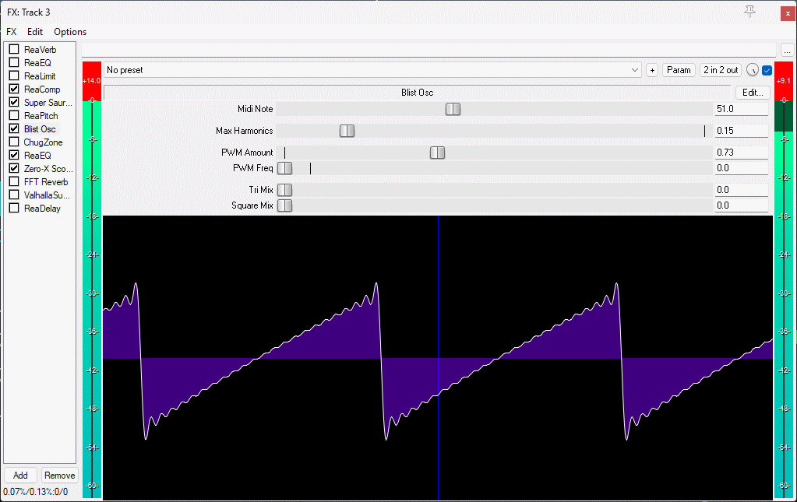

Blit Osc

based on this paper

https://ccrma.stanford.edu/~stilti/papers/blit.pdf

It's pretty clean - fun to play with the PWM and mixing tri/square e.t.c.
goes a bit beserk if you change freq too quickly e.t.c.

